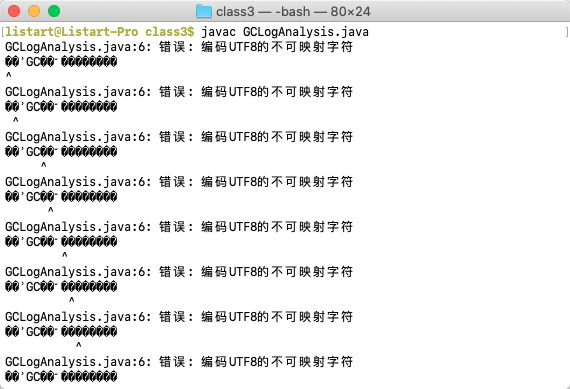

[toc]

# 学习笔记

# 第3课作业

开发机参数如下：

>  处理器名称：	Dual-Core Intel Core i5
>
>  处理器速度：	2.5 GHz
>
>  处理器数目：	1
>
>  核总数：	2
>
>  内存：	16 GB
>
>  系统版本：	macOS 10.15.5 (19F101)
>
>  内核版本：	Darwin 19.5.0


## GC案例演练

### 编译GCLogAnalysis.class

编译class文件，直接执行`javac GCLogAnalysis.java`命令行报错：




**错误分析** 

编译工具提示错误***编码UTF8的不可映射字符***。说明编译操作系统mac缺省字符集是`utf8`；而java文件很可能是在windows下编写，windows操作系统一般使用`gbk`作为缺省字符集，源代码中包含中文字符且在保存时未特别指明字符集的情况下，使用gbk编码存储的java文件。


**解决方法**

通过`javac -help`查到参数`-encoding <编码>`可以指定源文件使用的字符编码，指定`gbk`编码运行以下命令行编译成功：

```bash
javac -encoding gbk GCLogAnalysis.java
```


### 演练GC日志打印

演练环境为JDK8

```bash
java -version
java version "1.8.0_251"
Java(TM) SE Runtime Environment (build 1.8.0_251-b08)
Java HotSpot(TM) 64-Bit Server VM (build 25.251-b08, mixed mode)
```


演练方法如下：

- 分别使用串行(SerialGC)、并行(ParallelGC)、CMS(ConcMarkSweepGC)、G1四种**GC类型**
- 分别使用128M、512M、1024M、2048M、4096M五种**使用内存大小**
- 通过编写脚本 [gclog.sh](class3/gclog.sh) 生成**GC类型**和**使用内存大小**的执行GCLogAnalysis命令行的笛卡尔集，并顺序执行
- 命令行参数说明：
  - `-Xms`和`-Xmx`指定内存大小，单位m
  
  - `-XX:+PrintGCDetails`和`-XX:+PrintGCDateStamps`打开GC日志和时间戳
  
  - 使用`-Xloggc:log/${gc名}${使用内存大小}M.log`记录gc日志，程序运行结果通过管道指定标准输出和错误输出方式合并存入`log/${gc名}${使用内存大小}M.out`日志文件。
  
    > **NOTE** 若不使用`-Xloggc`参数指定gc日志文件，gc日志将混入标准输出打印出来，特别是CMS这种gc线程和用户业务线程并行的GC，可能出现gc日志和程序日志杂糅的情况。类似以下情况：
    >
    > ```bash
    > 2020-10-27T10:42:45.593-0800: [GC (Allocation Failure) 2020-10-27T10:42:45.593-0800: [ParNew2020-10-27T10:42:45.652-0800: [CMS-concurrent-abortable-preclean: 0.007/0.284 secs] [Times: user=0.68 sys=0.09, real=0.29 secs] 
    > 
    > : 306688K->34048K(306688K), 0.0591059 secs] 822053K->633214K(1014528K), 0.0592593 secs] [Times: user=0.20 sys=0.03, real=0.06 secs] 
    > ```


### GC日志分析及总结

使用`jupyter notebook`编写脚本 [gclog.ipynb](class3/gclog.ipynb) ，完成：

- 日志文件的框架解析和指标数据摘取，其中GC日志文件主要由以下几部分组成：

  1. JVM及内存信息

  2. 命令行参数标志信息

     执行命令行如下：

     ```bash
     java -XX:+UseConcMarkSweepGC -Xms128m -Xmx128m -Xloggc:log/ConcMarkSweepGC128M.log -XX:+PrintGCDetails -XX:+PrintGCDateStamps GCLogAnalysis > log/ConcMarkSweepGC128M.out 2>&1
     ```

     日志命令行参数如下：

     ```bash
     CommandLine flags: -XX:InitialHeapSize=134217728 -XX:MaxHeapSize=134217728 -XX:MaxNewSize=44740608 -XX:MaxTenuringThreshold=6 -XX:NewSize=44740608 -XX:OldPLABSize=16 -XX:OldSize=89477120 -XX:+PrintGC -XX:+PrintGCDateStamps -XX:+PrintGCDetails -XX:+PrintGCTimeStamps -XX:+UseCompressedClassPointers -XX:+UseCompressedOops -XX:+UseConcMarkSweepGC -XX:+UseParNewGC
     ```

     可见日志中的命令行参数明显是对进程命令行进行了**预处理**的。比如使用CMS的命令行只添加了`-XX:+UseConcMarkSweepGC`参数，但是预处理参数会配套缺省打开了`-XX:+UseParNewGC`参数。

  3. GC动作记录，记录的具体动作和动作数据由GC决定，四款GC均不相同，但是基本格式框架一致

  4. Heap分配信息

- 使用`pandas`做数据的整理与统计，按照GC空间分配、执行KPI以及各GC动作统计三个维度导出统计结果到 [gclog.xlsx](class3/gclog.xlsx) 。


#### 纬度：GC空间分配统计及分析

| **space**                            | **gc**          | **128M** | **128M%** | **512M** | **512M%** | **1024M** | **1024M%** | **2048M** | **2048M%** | **4096M** | **4096M%** |
| ------------------------------------ | --------------- | -------- | --------- | -------- | --------- | --------- | ---------- | --------- | ---------- | --------- | ---------- |
| **def new generation**               | SerialGC        | 39296    | 30.0%     | 157248   | 30.0%     | 314560    | 30.0%      | 629120    | 30.0%      | 1258304   | 30.0%      |
| **eden space**                       | SerialGC        | 34944    | 26.7%     | 139776   | 26.7%     | 279616    | 26.7%      | 559232    | 26.7%      | 1118528   | 26.7%      |
| **from space**                       | SerialGC        | 4352     | 3.3%      | 17472    | 3.3%      | 34944     | 3.3%       | 69888     | 3.3%       | 139776    | 3.3%       |
| **to  space**                        | SerialGC        | 4352     | 3.3%      | 17472    | 3.3%      | 34944     | 3.3%       | 69888     | 3.3%       | 139776    | 3.3%       |
| **tenured generation**               | SerialGC        | 87424    | 66.7%     | 349568   | 66.7%     | 699072    | 66.7%      | 1398144   | 66.7%      | 2796224   | 66.7%      |
| **Metaspace**                        | SerialGC        | 4486     | 3.4%      | 4486     | 0.9%      | 4486      | 0.4%       | 4486      | 0.2%       | 4486      | 0.1%       |
| **PSYoungGen**                       | ParallelGC      | 29184    | 22.3%     | 116736   | 22.3%     | 232960    | 22.2%      | 611840    | 29.2%      | 1223168   | 29.2%      |
| **eden space**                       | ParallelGC      | 14848    | 11.3%     | 58880    | 11.2%     | 116736    | 11.1%      | 524800    | 25.0%      | 1048576   | 25.0%      |
| **from space**                       | ParallelGC      | 14336    | 10.9%     | 57856    | 11.0%     | 116224    | 11.1%      | 87040     | 4.2%       | 174592    | 4.2%       |
| **to  space**                        | ParallelGC      | 14336    | 10.9%     | 57856    | 11.0%     | 116224    | 11.1%      | 87040     | 4.2%       | 174592    | 4.2%       |
| **ParOldGen**                        | ParallelGC      | 87552    | 66.8%     | 349696   | 66.7%     | 699392    | 66.7%      | 1398272   | 66.7%      | 2796544   | 66.7%      |
| **Metaspace**                        | ParallelGC      | 4486     | 3.4%      | 4486     | 0.9%      | 4486      | 0.4%       | 4486      | 0.2%       | 4486      | 0.1%       |
| **par new generation**               | ConcMarkSweepGC | 39296    | 30.0%     | 157248   | 30.0%     | 306688    | 29.2%      | 306688    | 14.6%      | 306688    | 7.3%       |
| **eden space**                       | ConcMarkSweepGC | 34944    | 26.7%     | 139776   | 26.7%     | 272640    | 26.0%      | 272640    | 13.0%      | 272640    | 6.5%       |
| **from space**                       | ConcMarkSweepGC | 4352     | 3.3%      | 17472    | 3.3%      | 34048     | 3.2%       | 34048     | 1.6%       | 34048     | 0.8%       |
| **to  space**                        | ConcMarkSweepGC | 4352     | 3.3%      | 17472    | 3.3%      | 34048     | 3.2%       | 34048     | 1.6%       | 34048     | 0.8%       |
| **concurrent mark-sweep generation** | ConcMarkSweepGC | 87424    | 66.7%     | 349568   | 66.7%     | 707840    | 67.5%      | 1756416   | 83.8%      | 3853568   | 91.9%      |
| **Metaspace**                        | ConcMarkSweepGC | 4486     | 3.4%      | 4486     | 0.9%      | 4486      | 0.4%       | 4486      | 0.2%       | 4486      | 0.1%       |
| **garbage-first heap**               | G1GC            | 131072   | 100.0%    | 524288   | 100.0%    | 1048576   | 100.0%     | 2097152   | 100.0%     | 4194304   | 100.0%     |
| **Metaspace**                        | G1GC            | 4486     | 3.4%      | 4486     | 0.9%      | 4486      | 0.4%       | 4486      | 0.2%       | 4486      | 0.1%       |

- SerialGC、ParallelGC、ConcMarkSweepGC堆按照缺省比例是1:2把堆划分为新生代和老年代。

  >  **NOTE** 日志中新生代分配空间统计往往只占30%，只包含了`eden`x1+`s`x1

  新生代分配规律如下：

  - **SerialGC** eden:s0:s1固定比率8:1:1。
  - **ParallelGC** 128M～1G，eden:s0:s1大致为1:1:1，**2G内存开始，固定比率6:1:1**。
  - **ConcMarkSweepGC** 堆内存不超过1G时，新生代:老年代为1:2，eden:s0:s1为6:1:1；超过1G新生代**固定分配300M，eden:s0:s1为8:1:1**。

- G1比较特殊，堆内存全部统一分块使用。

- 四款GC的Metaspace均是按需分配，均是**固定大小4486K**，不计入堆空间分配。


#### 纬度：执行KPI统计及分析

| **kpi**          | **gc**          | **128M**      | **512M**  | **1024M** | **2048M** | **4096M**     |
| ---------------- | --------------- | ------------- | --------- | --------- | --------- | ------------- |
| **malloc count** | SerialGC        | oom           | 8495      | 9526      | 8936      | 8340          |
| **gc time**      | SerialGC        | 0.2203233     | 0.5317736 | 0.4761164 | 0.3849548 | 0.3119198     |
| **max gc time**  | SerialGC        | **0.0356752** | 0.0497762 | 0.0634024 | 0.1231555 | 0.1670528     |
| **user time**    | SerialGC        | 0.2           | 0.44      | 0.28      | 0.22      | 0.17          |
| **sys time**     | SerialGC        | 0.02          | 0.1       | 0.19      | 0.14      | 0.13          |
| **real time**    | SerialGC        | 0.25          | 0.54      | 0.47      | 0.39      | 0.31          |
| **malloc count** | ParallelGC      | oom           | 7615      | 9913      | **10827** | 7964          |
| **gc time**      | ParallelGC      | 0.2532942     | 0.5895894 | 0.4416685 | 0.3141846 | 0.1976605     |
| **max gc time**  | ParallelGC      | **0.0445949** | 0.072921  | 0.1107432 | 0.0819969 | 0.1108067     |
| **user time**    | ParallelGC      | 0.58          | 1.81      | 0.96      | 0.46      | 0.23          |
| **sys time**     | ParallelGC      | 0.09          | 0.39      | 0.64      | 0.58      | 0.5           |
| **real time**    | ParallelGC      | 0.23          | 0.57      | 0.44      | 0.33      | **0.2**       |
| **malloc count** | ConcMarkSweepGC | oom           | 9499      | 9214      | 8881      | 7510          |
| **gc time**      | ConcMarkSweepGC | 0.3299705     | 0.7733838 | 0.4428692 | 0.4509581 | 0.4599602     |
| **max gc time**  | ConcMarkSweepGC | 0.0426154     | 0.2290541 | 0.0756926 | 0.0669561 | 0.0753754     |
| **user time**    | ConcMarkSweepGC | 0.4           | 1.65      | 1.13      | 1.2       | 1.19          |
| **sys time**     | ConcMarkSweepGC | 0.04          | 0.28      | 0.36      | 0.34      | **0.32**      |
| **real time**    | ConcMarkSweepGC | 0.35          | 0.79      | 0.43      | 0.46      | 0.46          |
| **malloc count** | G1GC            | oom           | 7564      | 8442      | 8870      | 9487          |
| **gc time**      | G1GC            | **0.1416237** | 0.3503903 | 0.2421226 | 0.2056847 | 0.3638654     |
| **max gc time**  | G1GC            | 0.041194      | 0.0766037 | 0.0856084 | 0.0304213 | **0.0367008** |
| **user time**    | G1GC            | 0.2           | 0.73      | 0.41      | 0.27      | 0.45          |
| **sys time**     | G1GC            | 0.05          | 0.13      | 0.4       | 0.36      | 0.7           |
| **real time**    | G1GC            | 0.13          | 0.26      | 0.21      | 0.23      | 0.36          |

- 128M内存均OOM，SerialGC的GC时间峰值最低，ParallelGC的GC时间峰值最高，G1总GC时间最低
- **SerialGC** 内存1G时`分配次数`最多，随着分配内存的增多，总gc时间有效降低，但gc峰值高至167ms
- **ParallelGC** 内存1G时`分配次数`是**所有GC中最多的**，随着分配内存的增多，总gc时间有效降低，但gc峰值高至110ms
- **ConcMarkSweepGC** 随着分配内存的增多，`分配次数`反而降低，`sys time`代表STW时间，因为GC线程跟业务线程并行的原因，`sys time`是四款GC最少的。
- **G1GC** gc峰值控制得最好的一款GC，4G时也才36.7ms。


#### 纬度：GC动作统计及分析

##### SerialGC

|                                       | **gc**    |           |                    |           |            | **user** |                     |          |            | **sys** |                    |          |            | **real** |                     |          |            |
| ------------------------------------- | --------- | --------- | ------------------ | --------- | ---------- | -------- | ------------------- | -------- | ---------- | ------- | ------------------ | -------- | ---------- | -------- | ------------------- | -------- | ---------- |
| **action**                            | **count** | **sum**   | **mean**           | **amax**  | **median** | **sum**  | **mean**            | **amax** | **median** | **sum** | **mean**           | **amax** | **median** | **sum**  | **mean**            | **amax** | **median** |
| **128M Full GC (Allocation Failure)** | 17        | 0.1410473 | 0.0082969          | 0.0180618 | 0.0045545  | 0.14     | 0.00823529411764706 | 0.02     | 0.01       | 0       | 0                  | 0        | 0          | 0.15     | 0.00882352941176471 | 0.02     | 0.01       |
| **128M GC (Allocation Failure)**      | 8         | 0.079276  | 0.0099095          | 0.0176134 | 0.00913855 | 0.06     | 0.0075              | 0.02     | 0.01       | 0.02    | 0.0025             | 0.01     | 0          | 0.1      | 0.0125              | 0.02     | 0.01       |
| **512M GC (Allocation Failure)**      | 16        | 0.5317736 | 0.03323585         | 0.0497762 | 0.0304499  | 0.44     | 0.0275              | 0.05     | 0.02       | 0.1     | 0.00625            | 0.02     | 0.005      | 0.54     | 0.03375             | 0.05     | 0.03       |
| **1024M GC (Allocation Failure)**     | 9         | 0.4761164 | 0.0529018222222222 | 0.0634024 | 0.0514873  | 0.28     | 0.0311111111111111  | 0.04     | 0.03       | 0.19    | 0.0211111111111111 | 0.03     | 0.02       | 0.47     | 0.0522222222222222  | 0.07     | 0.05       |
| **2048M GC (Allocation Failure)**     | 4         | 0.3849548 | 0.0962387          | 0.1231555 | 0.0890276  | 0.22     | 0.055               | 0.06     | 0.055      | 0.14    | 0.035              | 0.05     | 0.03       | 0.39     | 0.0975              | 0.12     | 0.09       |
| **4096M GC (Allocation Failure)**     | 2         | 0.3119198 | 0.1559599          | 0.1670528 | 0.1559599  | 0.17     | 0.085               | 0.09     | 0.085      | 0.13    | 0.065              | 0.07     | 0.065      | 0.31     | 0.155               | 0.17     | 0.155      |

- GC触发均是Allocation Failure原因，仅128M内存不足时连续触发17次Full GC
- 随着内存的增大，gc时间减少，单次gc峰值明显增高


##### ParallelGC

|                                       | **gc**    |           |                    |           |            | **user** |                    |          |            | **sys** |                     |          |            | **real** |                     |          |            |
| ------------------------------------- | --------- | --------- | ------------------ | --------- | ---------- | -------- | ------------------ | -------- | ---------- | ------- | ------------------- | -------- | ---------- | -------- | ------------------- | -------- | ---------- |
| **action**                            | **count** | **sum**   | **mean**           | **amax**  | **median** | **sum**  | **mean**           | **amax** | **median** | **sum** | **mean**            | **amax** | **median** | **sum**  | **mean**            | **amax** | **median** |
| **128M Full GC (Allocation Failure)** | 1         | 0.0126526 | 0.0126526          | 0.0126526 | 0.0126526  | 0.04     | 0.04               | 0.04     | 0.04       | 0       | 0                   | 0        | 0          | 0.02     | 0.02                | 0.02     | 0.02       |
| **128M Full GC (Ergonomics)**         | 18        | 0.1759959 | 0.00977755         | 0.0182561 | 0.0112237  | 0.44     | 0.0244444444444444 | 0.06     | 0.03       | 0.02    | 0.00111111111111111 | 0.01     | 0          | 0.14     | 0.00777777777777778 | 0.02     | 0.01       |
| **128M GC (Allocation Failure)**      | 10        | 0.0646457 | 0.00646457         | 0.0136862 | 0.0060865  | 0.1      | 0.01               | 0.01     | 0.01       | 0.07    | 0.007               | 0.01     | 0.01       | 0.07     | 0.007               | 0.02     | 0.01       |
| **512M Full GC (Ergonomics)**         | 7         | 0.3216417 | 0.0459488142857143 | 0.0492173 | 0.0448372  | 1.2      | 0.171428571428571  | 0.19     | 0.17       | 0.03    | 0.00428571428571429 | 0.01     | 0          | 0.31     | 0.0442857142857143  | 0.05     | 0.04       |
| **512M GC (Allocation Failure)**      | 26        | 0.2679477 | 0.0103056807692308 | 0.0237037 | 0.0076908  | 0.61     | 0.0234615384615385 | 0.04     | 0.02       | 0.36    | 0.0138461538461539  | 0.06     | 0          | 0.26     | 0.01                | 0.02     | 0.01       |
| **1024M Full GC (Ergonomics)**        | 1         | 0.0631294 | 0.0631294          | 0.0631294 | 0.0631294  | 0.21     | 0.21               | 0.21     | 0.21       | 0.02    | 0.02                | 0.02     | 0.02       | 0.06     | 0.06                | 0.06     | 0.06       |
| **1024M GC (Allocation Failure)**     | 15        | 0.3785391 | 0.02523594         | 0.0476138 | 0.0279183  | 0.75     | 0.05               | 0.07     | 0.05       | 0.62    | 0.0413333333333333  | 0.11     | 0.06       | 0.38     | 0.0253333333333333  | 0.05     | 0.03       |
| **2048M GC (Allocation Failure)**     | 5         | 0.3141846 | 0.06283692         | 0.0819969 | 0.0599511  | 0.46     | 0.092              | 0.11     | 0.09       | 0.58    | 0.116               | 0.14     | 0.12       | 0.33     | 0.066               | 0.09     | 0.06       |
| **4096M GC (Allocation Failure)**     | 2         | 0.1976605 | 0.09883025         | 0.1108067 | 0.09883025 | 0.23     | 0.115              | 0.13     | 0.115      | 0.5     | 0.25                | 0.28     | 0.25       | 0.2      | 0.1                 | 0.11     | 0.1        |

- 一般GC原因是GC (Allocation Failure) 、Full GC (Ergonomics)，唯一一次**Full GC (Allocation Failure)**触发OOM。
- 随着内存的增大，Full GC (Ergonomics)和GC (Allocation Failure)的GC时间及峰值都显著提升，但是Full GC次数减少。


##### ConcMarkSweepGC

|                                                   | **gc**    | **user**  | **sys**              | **real**  |            |         |                     |          |            |         |                     |          |            |         |                     |          |            |
| ------------------------------------------------- | --------- | --------- | -------------------- | --------- | ---------- | ------- | ------------------- | -------- | ---------- | ------- | ------------------- | -------- | ---------- | ------- | ------------------- | -------- | ---------- |
| **action**                                        | **count** | **sum**   | **mean**             | **amax**  | **median** | **sum** | **mean**            | **amax** | **median** | **sum** | **mean**            | **amax** | **median** | **sum** | **mean**            | **amax** | **median** |
| **128M CMS-concurrent-abortable-preclean**        | 5         | 0         | 0                    | 0         | 0          | 0       | 0                   | 0        | 0          | 0       | 0                   | 0        | 0          | 0       | 0                   | 0        | 0          |
| **128M CMS-concurrent-abortable-preclean-start**  | 6         | 0         |                      |           |            | 0       |                     |          |            | 0       |                     |          |            | 0       |                     |          |            |
| **128M CMS-concurrent-mark**                      | 9         | 0.01      | 0.00111111111111111  | 0.002     | 0.001      | 0.01    | 0.00111111111111111 | 0.01     | 0          | 0       | 0                   | 0        | 0          | 0.03    | 0.00333333333333333 | 0.01     | 0          |
| **128M CMS-concurrent-mark-start**                | 13        | 0         |                      |           |            | 0       |                     |          |            | 0       |                     |          |            | 0       |                     |          |            |
| **128M CMS-concurrent-preclean**                  | 6         | 0.005     | 0.000833333333333333 | 0.001     | 0.001      | 0       | 0                   | 0        | 0          | 0       | 0                   | 0        | 0          | 0       | 0                   | 0        | 0          |
| **128M CMS-concurrent-preclean-start**            | 9         | 0         |                      |           |            | 0       |                     |          |            | 0       |                     |          |            | 0       |                     |          |            |
| **128M CMS-concurrent-reset**                     | 4         | 0         | 0                    | 0         | 0          | 0       | 0                   | 0        | 0          | 0       | 0                   | 0        | 0          | 0       | 0                   | 0        | 0          |
| **128M CMS-concurrent-reset-start**               | 4         | 0         |                      |           |            | 0       |                     |          |            | 0       |                     |          |            | 0       |                     |          |            |
| **128M CMS-concurrent-sweep**                     | 4         | 0         | 0                    | 0         | 0          | 0       | 0                   | 0        | 0          | 0       | 0                   | 0        | 0          | 0       | 0                   | 0        | 0          |
| **128M CMS-concurrent-sweep-start**               | 5         | 0         |                      |           |            | 0       |                     |          |            | 0       |                     |          |            | 0       |                     |          |            |
| **128M Full GC (Allocation Failure)**             | 15        | 0.1423748 | 0.00949165333333333  | 0.0182467 | 0.0094909  | 0.11    | 0.00733333333333333 | 0.02     | 0.01       | 0       | 0                   | 0        | 0          | 0.16    | 0.0106666666666667  | 0.02     | 0.01       |
| **128M GC (Allocation Failure)**                  | 13        | 0.1633779 | 0.0125675307692308   | 0.0197839 | 0.0105731  | 0.28    | 0.0215384615384615  | 0.04     | 0.02       | 0.04    | 0.00307692307692308 | 0.01     | 0          | 0.16    | 0.0123076923076923  | 0.02     | 0.01       |
| **128M GC (CMS Final Remark)**                    | 5         | 0.0061829 | 0.00123658           | 0.0012765 | 0.0012579  | 0       | 0                   | 0        | 0          | 0       | 0                   | 0        | 0          | 0       | 0                   | 0        | 0          |
| **128M GC (CMS Initial Mark)**                    | 13        | 0.0030349 | 0.000233453846153846 | 0.0003083 | 0.000232   | 0       | 0                   | 0        | 0          | 0       | 0                   | 0        | 0          | 0       | 0                   | 0        | 0          |
| **512M CMS-concurrent-abortable-preclean**        | 6         | 0.196     | 0.0326666666666667   | 0.163     | 0          | 0.46    | 0.0766666666666667  | 0.41     | 0          | 0.06    | 0.01                | 0.06     | 0          | 0.19    | 0.0316666666666667  | 0.16     | 0          |
| **512M CMS-concurrent-abortable-preclean-start**  | 7         | 0         |                      |           |            | 0       |                     |          |            | 0       |                     |          |            | 0       |                     |          |            |
| **512M CMS-concurrent-mark**                      | 7         | 0.026     | 0.00371428571428571  | 0.006     | 0.003      | 0.03    | 0.00428571428571429 | 0.01     | 0          | 0       | 0                   | 0        | 0          | 0.01    | 0.00142857142857143 | 0.01     | 0          |
| **512M CMS-concurrent-mark-start**                | 8         | 0         |                      |           |            | 0       |                     |          |            | 0       |                     |          |            | 0       |                     |          |            |
| **512M CMS-concurrent-preclean**                  | 7         | 0.007     | 0.001                | 0.001     | 0.001      | 0.02    | 0.00285714285714286 | 0.01     | 0          | 0       | 0                   | 0        | 0          | 0.02    | 0.00285714285714286 | 0.01     | 0          |
| **512M CMS-concurrent-preclean-start**            | 7         | 0         |                      |           |            | 0       |                     |          |            | 0       |                     |          |            | 0       |                     |          |            |
| **512M CMS-concurrent-reset**                     | 6         | 0.001     | 0.000166666666666667 | 0.001     | 0          | 0       | 0                   | 0        | 0          | 0       | 0                   | 0        | 0          | 0       | 0                   | 0        | 0          |
| **512M CMS-concurrent-reset-start**               | 6         | 0         |                      |           |            | 0       |                     |          |            | 0       |                     |          |            | 0       |                     |          |            |
| **512M CMS-concurrent-sweep**                     | 6         | 0.006     | 0.001                | 0.001     | 0.001      | 0.01    | 0.00166666666666667 | 0.01     | 0          | 0       | 0                   | 0        | 0          | 0       | 0                   | 0        | 0          |
| **512M CMS-concurrent-sweep-start**               | 6         | 0         |                      |           |            | 0       |                     |          |            | 0       |                     |          |            | 0       |                     |          |            |
| **512M GC (Allocation Failure)**                  | 18        | 0.5264081 | 0.0292448944444445   | 0.0547879 | 0.03140245 | 1.11    | 0.0616666666666667  | 0.12     | 0.05       | 0.22    | 0.0122222222222222  | 0.06     | 0          | 0.54    | 0.03                | 0.06     | 0.03       |
| **512M GC (CMS Final Remark)**                    | 6         | 0.0093264 | 0.0015544            | 0.0020018 | 0.00146765 | 0.02    | 0.00333333333333333 | 0.01     | 0          | 0       | 0                   | 0        | 0          | 0.02    | 0.00333333333333333 | 0.01     | 0          |
| **512M GC (CMS Initial Mark)**                    | 8         | 0.0016493 | 0.0002061625         | 0.0002644 | 0.0001973  | 0       | 0                   | 0        | 0          | 0       | 0                   | 0        | 0          | 0.01    | 0.00125             | 0.01     | 0          |
| **1024M CMS-concurrent-abortable-preclean-start** | 1         | 0         |                      |           |            | 0       |                     |          |            | 0       |                     |          |            | 0       |                     |          |            |
| **1024M CMS-concurrent-mark**                     | 1         | 0.011     | 0.011                | 0.011     | 0.011      | 0.02    | 0.02                | 0.02     | 0.02       | 0       | 0                   | 0        | 0          | 0.01    | 0.01                | 0.01     | 0.01       |
| **1024M CMS-concurrent-mark-start**               | 1         | 0         |                      |           |            | 0       |                     |          |            | 0       |                     |          |            | 0       |                     |          |            |
| **1024M CMS-concurrent-preclean**                 | 1         | 0.001     | 0.001                | 0.001     | 0.001      | 0       | 0                   | 0        | 0          | 0       | 0                   | 0        | 0          | 0       | 0                   | 0        | 0          |
| **1024M CMS-concurrent-preclean-start**           | 1         | 0         |                      |           |            | 0       |                     |          |            | 0       |                     |          |            | 0       |                     |          |            |
| **1024M GC (Allocation Failure)**                 | 8         | 0.4306977 | 0.0538372125         | 0.0635211 | 0.0558073  | 1.11    | 0.13875             | 0.19     | 0.17       | 0.36    | 0.045               | 0.09     | 0.03       | 0.42    | 0.0525              | 0.06     | 0.055      |
| **1024M GC (CMS Initial Mark)**                   | 1         | 0.0001715 | 0.0001715            | 0.0001715 | 0.0001715  | 0       | 0                   | 0        | 0          | 0       | 0                   | 0        | 0          | 0       | 0                   | 0        | 0          |
| **2048M GC (Allocation Failure)**                 | 8         | 0.4509581 | 0.0563697625         | 0.0669561 | 0.05895685 | 1.2     | 0.15                | 0.2      | 0.18       | 0.34    | 0.0425              | 0.09     | 0.03       | 0.46    | 0.0575              | 0.07     | 0.06       |
| **4096M GC (Allocation Failure)**                 | 7         | 0.4599602 | 0.0657086            | 0.0753754 | 0.0709939  | 1.19    | 0.17                | 0.23     | 0.17       | 0.32    | 0.0457142857142857  | 0.08     | 0.03       | 0.46    | 0.0657142857142857  | 0.08     | 0.07       |

- 连续**Full GC (Allocation Failure)**触发OOM
- 大内存(超过2G)时，GC事件种类和次数明显减少，GC事件的时间峰值控制效果明显，4G时才达到75ms。


##### G1GC

|                                                              | **gc**    | **user**  | **sys**              | **real**  |            |         |                     |          |            |         |                      |          |            |         |                      |          |            |
| ------------------------------------------------------------ | --------- | --------- | -------------------- | --------- | ---------- | ------- | ------------------- | -------- | ---------- | ------- | -------------------- | -------- | ---------- | ------- | -------------------- | -------- | ---------- |
| **action**                                                   | **count** | **sum**   | **mean**             | **amax**  | **median** | **sum** | **mean**            | **amax** | **median** | **sum** | **mean**             | **amax** | **median** | **sum** | **mean**             | **amax** | **median** |
| **128M Full GC (Allocation Failure)**                        | 7         | 0.0481892 | 0.00688417142857143  | 0.0140329 | 0.0028795  | 0.05    | 0.00714285714285714 | 0.01     | 0.01       | 0       | 0                    | 0        | 0          | 0.05    | 0.00714285714285714  | 0.01     | 0.01       |
| **128M GC cleanup**                                          | 8         | 0.003497  | 0.000437125          | 0.0009998 | 0.0003442  | 0       | 0                   | 0        | 0          | 0       | 0                    | 0        | 0          | 0       | 0                    | 0        | 0          |
| **128M GC concurrent-mark-abort**                            | 2         | 0         |                      |           |            | 0       |                     |          |            | 0       |                      |          |            | 0       |                      |          |            |
| **128M GC concurrent-mark-end**                              | 8         | 0.0118815 | 0.0014851875         | 0.0024974 | 0.00144935 | 0       |                     |          |            | 0       |                      |          |            | 0       |                      |          |            |
| **128M GC concurrent-mark-start**                            | 10        | 0         |                      |           |            | 0       |                     |          |            | 0       |                      |          |            | 0       |                      |          |            |
| **128M GC concurrent-root-region-scan-end**                  | 10        | 0.0010313 | 0.00010313           | 0.0001515 | 0.0001368  | 0       |                     |          |            | 0       |                      |          |            | 0       |                      |          |            |
| **128M GC concurrent-root-region-scan-start**                | 10        | 0         |                      |           |            | 0       |                     |          |            | 0       |                      |          |            | 0       |                      |          |            |
| **128M GC pause (G1 Evacuation Pause) (mixed)**              | 2         | 0.0032332 | 0.0016166            | 0.0017525 | 0.0016166  | 0       | 0                   | 0        | 0          | 0       | 0                    | 0        | 0          | 0       | 0                    | 0        | 0          |
| **128M GC pause (G1 Evacuation Pause) (mixed) (to-space exhausted)** | 5         | 0.0085158 | 0.00170316           | 0.0028373 | 0.0013045  | 0.03    | 0.006               | 0.01     | 0.01       | 0.01    | 0.002                | 0.01     | 0          | 0.01    | 0.002                | 0.01     | 0          |
| **128M GC pause (G1 Evacuation Pause) (young)**              | 12        | 0.0276737 | 0.00230614166666667  | 0.0059486 | 0.0017173  | 0.05    | 0.00416666666666667 | 0.01     | 0          | 0.02    | 0.00166666666666667  | 0.01     | 0          | 0.03    | 0.0025               | 0.01     | 0          |
| **128M GC pause (G1 Evacuation Pause) (young) (initial-mark)** | 1         | 0.0006197 | 0.0006197            | 0.0006197 | 0.0006197  | 0       | 0                   | 0        | 0          | 0       | 0                    | 0        | 0          | 0       | 0                    | 0        | 0          |
| **128M GC pause (G1 Evacuation Pause) (young) (to-space exhausted)** | 9         | 0.010491  | 0.00116566666666667  | 0.0033464 | 0.0008802  | 0.02    | 0.00222222222222222 | 0.01     | 0          | 0.01    | 0.00111111111111111  | 0.01     | 0          | 0       | 0                    | 0        | 0          |
| **128M GC pause (G1 Humongous Allocation) (young) (initial-mark)** | 9         | 0.0134174 | 0.00149082222222222  | 0.0060203 | 0.0009672  | 0.03    | 0.00333333333333333 | 0.01     | 0          | 0.01    | 0.00111111111111111  | 0.01     | 0          | 0.03    | 0.00333333333333333  | 0.01     | 0          |
| **128M GC remark**                                           | 8         | 0.0130739 | 0.0016342375         | 0.0029876 | 0.0014907  | 0.02    | 0.0025              | 0.01     | 0          | 0       | 0                    | 0        | 0          | 0.01    | 0.00125              | 0.01     | 0          |
| **512M GC cleanup**                                          | 14        | 0.0096038 | 0.000685985714285714 | 0.0015685 | 0.000561   | 0       | 0                   | 0        | 0          | 0.02    | 0.00142857142857143  | 0.01     | 0          | 0.01    | 0.000714285714285714 | 0.01     | 0          |
| **512M GC concurrent-cleanup-end**                           | 1         | 0.0000153 | 0.0000153            | 0.0000153 | 0.0000153  | 0       |                     |          |            | 0       |                      |          |            | 0       |                      |          |            |
| **512M GC concurrent-cleanup-start**                         | 1         | 0         |                      |           |            | 0       |                     |          |            | 0       |                      |          |            | 0       |                      |          |            |
| **512M GC concurrent-mark-end**                              | 14        | 0.0317243 | 0.00226602142857143  | 0.0038988 | 0.0021637  | 0       |                     |          |            | 0       |                      |          |            | 0       |                      |          |            |
| **512M GC concurrent-mark-start**                            | 14        | 0         |                      |           |            | 0       |                     |          |            | 0       |                      |          |            | 0       |                      |          |            |
| **512M GC concurrent-root-region-scan-end**                  | 14        | 0.0045099 | 0.000322135714285714 | 0.0028867 | 0.00012345 | 0       |                     |          |            | 0       |                      |          |            | 0       |                      |          |            |
| **512M GC concurrent-root-region-scan-start**                | 14        | 0         |                      |           |            | 0       |                     |          |            | 0       |                      |          |            | 0       |                      |          |            |
| **512M GC pause (G1 Evacuation Pause) (mixed)**              | 18        | 0.1102739 | 0.00612632777777778  | 0.0096986 | 0.00635485 | 0.33    | 0.0183333333333333  | 0.03     | 0.02       | 0.03    | 0.00166666666666667  | 0.01     | 0          | 0.09    | 0.005                | 0.01     | 0.005      |
| **512M GC pause (G1 Evacuation Pause) (young)**              | 16        | 0.1115088 | 0.0069693            | 0.0300682 | 0.0052435  | 0.19    | 0.011875            | 0.02     | 0.01       | 0.03    | 0.001875             | 0.01     | 0          | 0.1     | 0.00625              | 0.03     | 0.005      |
| **512M GC pause (G1 Evacuation Pause) (young) (to-space exhausted)** | 2         | 0.0227672 | 0.0113836            | 0.0166979 | 0.0113836  | 0.04    | 0.02                | 0.02     | 0.02       | 0.04    | 0.02                 | 0.04     | 0.02       | 0.03    | 0.015                | 0.02     | 0.015      |
| **512M GC pause (G1 Humongous Allocation) (young) (initial-mark)** | 14        | 0.0270344 | 0.00193102857142857  | 0.0067986 | 0.0016064  | 0.08    | 0.00571428571428571 | 0.02     | 0.005      | 0.01    | 0.000714285714285714 | 0.01     | 0          | 0.02    | 0.00142857142857143  | 0.01     | 0          |
| **512M GC remark**                                           | 14        | 0.0329527 | 0.00235376428571429  | 0.0049711 | 0.0021709  | 0.09    | 0.00642857142857143 | 0.01     | 0.01       | 0       | 0                    | 0        | 0          | 0.01    | 0.000714285714285714 | 0.01     | 0          |
| **1024M GC cleanup**                                         | 3         | 0.0025273 | 0.000842433333333333 | 0.0008827 | 0.0008422  | 0.01    | 0.00333333333333333 | 0.01     | 0          | 0       | 0                    | 0        | 0          | 0       | 0                    | 0        | 0          |
| **1024M GC concurrent-cleanup-end**                          | 3         | 0.0000558 | 0.0000186            | 0.0000243 | 0.0000158  | 0       |                     |          |            | 0       |                      |          |            | 0       |                      |          |            |
| **1024M GC concurrent-cleanup-start**                        | 3         | 0         |                      |           |            | 0       |                     |          |            | 0       |                      |          |            | 0       |                      |          |            |
| **1024M GC concurrent-mark-end**                             | 3         | 0.0113787 | 0.0037929            | 0.0058473 | 0.0032298  | 0       |                     |          |            | 0       |                      |          |            | 0       |                      |          |            |
| **1024M GC concurrent-mark-start**                           | 3         | 0         |                      |           |            | 0       |                     |          |            | 0       |                      |          |            | 0       |                      |          |            |
| **1024M GC concurrent-root-region-scan-end**                 | 3         | 0.0003843 | 0.0001281            | 0.0001592 | 0.0001129  | 0       |                     |          |            | 0       |                      |          |            | 0       |                      |          |            |
| **1024M GC concurrent-root-region-scan-start**               | 3         | 0         |                      |           |            | 0       |                     |          |            | 0       |                      |          |            | 0       |                      |          |            |
| **1024M GC pause (G1 Evacuation Pause) (mixed)**             | 2         | 0.0204179 | 0.01020895           | 0.0108526 | 0.01020895 | 0.06    | 0.03                | 0.03     | 0.03       | 0.02    | 0.01                 | 0.01     | 0.01       | 0.02    | 0.01                 | 0.01     | 0.01       |
| **1024M GC pause (G1 Evacuation Pause) (young)**             | 12        | 0.1674908 | 0.0139575666666667   | 0.0345918 | 0.011322   | 0.26    | 0.0216666666666667  | 0.05     | 0.02       | 0.33    | 0.0275               | 0.08     | 0.02       | 0.15    | 0.0125               | 0.03     | 0.01       |
| **1024M GC pause (G1 Evacuation Pause) (young) (to-space exhausted)** | 1         | 0.0139096 | 0.0139096            | 0.0139096 | 0.0139096  | 0.03    | 0.03                | 0.03     | 0.03       | 0.02    | 0.02                 | 0.02     | 0.02       | 0.01    | 0.01                 | 0.01     | 0.01       |
| **1024M GC pause (G1 Humongous Allocation) (young) (initial-mark)** | 3         | 0.0193937 | 0.00646456666666667  | 0.0170558 | 0.001178   | 0.03    | 0.01                | 0.03     | 0          | 0.03    | 0.01                 | 0.03     | 0          | 0.02    | 0.00666666666666667  | 0.02     | 0          |
| **1024M GC remark**                                          | 3         | 0.0065645 | 0.00218816666666667  | 0.0022851 | 0.0022269  | 0.02    | 0.00666666666666667 | 0.01     | 0.01       | 0       | 0                    | 0        | 0          | 0.01    | 0.00333333333333333  | 0.01     | 0          |
| **2048M GC pause (G1 Evacuation Pause) (young)**             | 12        | 0.2056847 | 0.0171403916666667   | 0.0304213 | 0.0131157  | 0.27    | 0.0225              | 0.04     | 0.02       | 0.36    | 0.03                 | 0.07     | 0.025      | 0.23    | 0.0191666666666667   | 0.03     | 0.02       |
| **4096M GC pause (G1 Evacuation Pause) (young)**             | 13        | 0.3638654 | 0.0279896461538462   | 0.0367008 | 0.0261125  | 0.45    | 0.0346153846153846  | 0.04     | 0.03       | 0.7     | 0.0538461538461538   | 0.08     | 0.05       | 0.36    | 0.0276923076923077   | 0.04     | 0.03       |

- 连续**Full GC (Allocation Failure)**触发OOM
- 大内存(超过2G)时，GC事件种类和次数明显减少，GC事件的时间峰值控制效果明显，4G时才达到36.7ms。


## 压测演练


# 第4课作业

## 运行示例

运行结果如下

```bash
listart@Listart-Pro classes$ curl http://localhost:8801
curl: (56) Recv failure: Connection reset by peer
hello.nio
```

### 结果说明

`curl`已接收到`hello.nio`结果，但是报错`curl: (56) Recv failure: Connection reset by peer`

### 错误定位及解决

mac系统上，服务器程序为接收完来自curl的请求流就关闭连接，导致报错。因此在服务器侧回发消息前，先处理完InputStream，代码如下：

```java
private static void service(Socket socket) {
  try {
    Thread.sleep(20);

    BufferedReader in = new BufferedReader(new InputStreamReader(socket.getInputStream()));
    String s;
    while ((s=in.readLine()) != null) {
      if ("".equals(s))
        break;
    }

    PrintWriter printWriter = new PrintWriter(socket.getOutputStream(), true);
    printWriter.println("HTTP/1.1 200 OK");
    printWriter.println("Content-Type:text/html;charset=utf-8");
    printWriter.println();
    printWriter.write("hello.nio");

    printWriter.close();
    in.close();
    socket.close();

  } catch (InterruptedException | IOException e) {
    e.printStackTrace();
  }
}
```

运行正常：

```bash
listart@Listart-Pro classes$ curl http://localhost:8801
hello.nio
```


