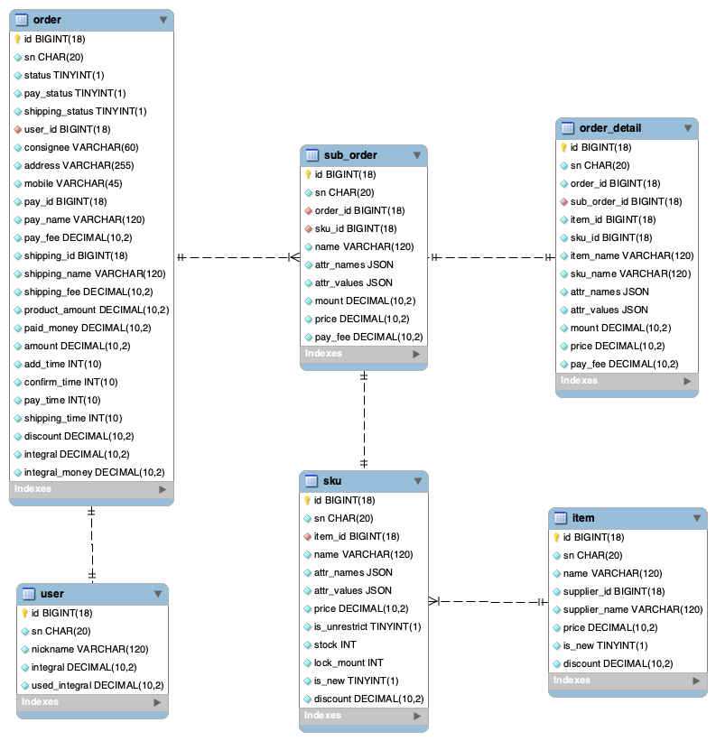
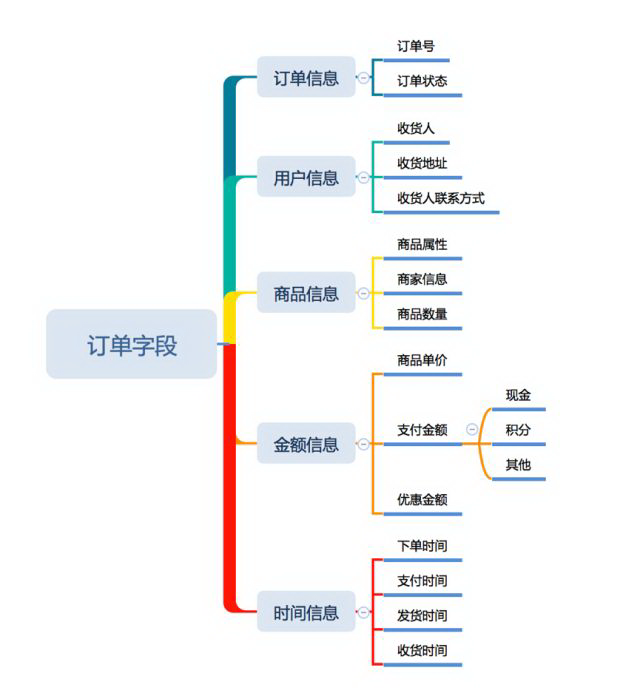
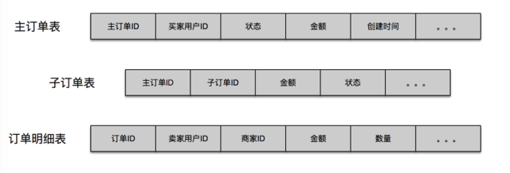

# Java相关框架（3）


# 性能与SQL优化（1）

## 深入数据库原理

### NF(Normal Form)范式

#### 设计目标

各级范式的主要设计目标是为了解决数据存用以下4个方面问题：

1. 数据冗余
2. 修改异常
3. 删除异常
4. 添加异常


SQL解析

1、手写，druid，mycat
2、antlr4，shardingsphere
3、yacc，mysql，tidb，Cockroachdb，


推荐书籍

《mysql技术内幕》

《数据库系统全书》

《数据密集型应用系统设计》


数据库设计优化-最佳实践

如何恰当选择引擎？业务数据需要innodb，记录用户操作之类的可以用myisam，有些临时表用内存表

如何选择恰当数据类型：

明确==》长度固定
text/blob/clob尽量少用

时间日期的存储问题？根据需要选择合适的格式；注意时区默认用了UTC；建议直接存时间戳

数值精度问题？超出Integer、float精度范围怎么办？

是否使用外键、触发器？尽量不用

唯一约束和索引的关系？唯一约束在当前主流数据库上都会默认创建索引

是否使用游标、变量、视图、自定义函数、存储过程？不建议使用，应用薄成了一层皮，而且无法移植

自增主键的使用问题？单机可以使用，分布式环境慎用

在线修改DDL？全局数据库加锁的问题，有时候必须得干

逻辑删除还是物理删除？尽可能逻辑删除

要不要加时间戳？非常建议加


## *作业2

基于电商交易场景(用户、商品、订单)，设计一套简单的表结构，提交DDL的SQL文件到Github(后面2周的作业依然要是用到这个表结构)。



数据库设计工具 ***MySQL WorkBench***

设计文件 [ec_structure.mwb](ec_structure.mwb) 

DDL文件  [ec_structure.sql](ec_structure.sql) 


> 相关字段及命名主要参考ecshop相关[库表结构](https://github.com/shopex/ecshop/blob/master/upload/install/data/structure.sql)

> 订单设计主要参考[《电商系统之订单设计篇》](https://www.infoq.cn/article/Jo81gruwb12hu4ahBoaj)一文。
>
> 
>
> 订单系统业务的基本模型涉及用户、商品（库存）、订单、付款，订单基本流程是**下订单——>减库存，这两步必须同时完成**，不能下了订单不减库存（超卖），或者减了库存没有生成订单（少卖）。超卖商家库存不足，消费者下了单买不到东西，体验不好；少卖商家库存积压或者需要反复修改商品信息，反复麻烦，体验也不好。
>
> ***PS:*** 上帝视角的订单系统图，特别有AOP的感觉。
>
> 
>
> 
>
> 订单字段包含了订单中需要记录的信息，他的作用主要用于沟通其他系统，为下游系统提供信息依据。
>
> 
>
> 
>
> 订单数据主要由三张数据库表组成，主订单表对应的就是用户的一个订单，每提交一次都会生成一条主订单表的数据。在有些情况下，用户可能在一个订单中选择不同卖家的商品，而每个卖家又会按照该订单中自己提供的商品计算相关的商品优惠（如满 100 元减 10 元）以及按照不同的收货地址设置不同的物流配送，所以会出现子订单的相关概念，即一个主订单会由多个子订单组成，而真正对应到具体每个商品订单信息，则保存在订单详情表中。


## 解析SQL

暂只支持select * from TABLE

安装环境参考antlr4官网，测试命令行如下：

```bash
listart@Listart-Pro sql$ antlr4 SQL.g4
listart@Listart-Pro sql$ javac *.java
listart@Listart-Pro sql$ grun SQL dql -tokens test.sql
[@0,0:5='select',<'select'>,1:0]
[@1,7:7='*',<'*'>,1:7]
[@2,9:12='from',<'from'>,1:9]
[@3,14:15='t1',<TABLE>,1:14]
[@4,18:17='<EOF>',<EOF>,3:0]
```


> 参考资料
>
> [1] **《The Definitive ANTLR 4 Reference》**  by Terence Parr [官网](https://www.antlr.org/) | [grammars-v4库](https://github.com/antlr/grammars-v4) | [下载地址](https://github.com/joaoBordalo/feup-COMP/blob/master/The%20Definitive%20ANTLR%204%20Reference.pdf)
>
> [2] [ANTLR 4进阶](https://liangshuang.name/2017/08/20/antlr/) from liangshuang.name
>
> [3] [ANTLR4 笔记](https://abcdabcd987.com/notes-on-antlr4/) [ANTLR4 使用技巧](https://abcdabcd987.com/using-antlr4/) from abcdabcd987.com

