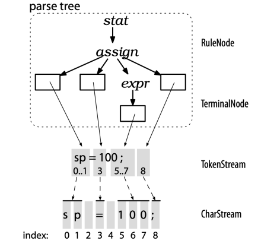
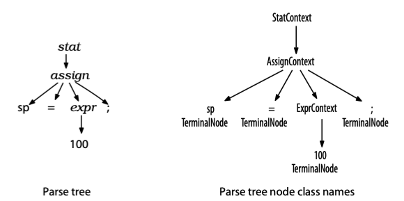
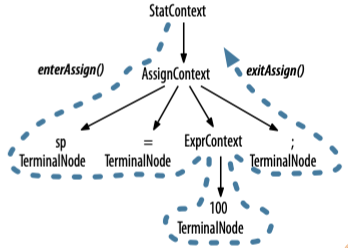
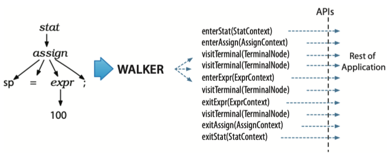
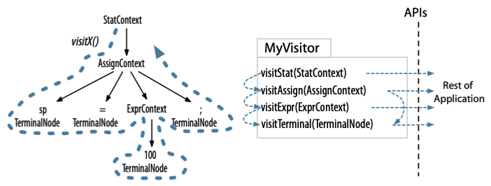
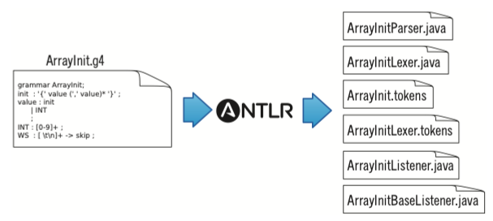

## 使用Parse Tree






## Parse-Tree Listeners and Visitors

### Parse-Tree Listeners





### Parse-Tree Visitors




# 3. A Starter ANTLR Project


## 例1 ArrayInit

```java
static short[] data = {1, 2, 3};
```

把上面的语句转化为等效的Unicode字符串常量

```java
static String data = "\u0001\u0002\u0003"; // Java char are unsigned short
```

这样做的目的是为了突破Java的.class文件格式限制。

Java的class文件把数组初始化器存储为一系列显示的元素初始化器，类似`data[0]=1; data[1]=2; data[2]=3;`，而不是紧凑的包字节块。

因为Java限制了初始化方法的大小，所以限制了可初始化数组的大小。

相反，Java的class文件把字符串存储为连续的short序列。

因此，将数组初始值设定项转换为字符串会产生更紧凑的类文件，避免Java初始化方法的大小限制。





# 4. A Quick Tour

